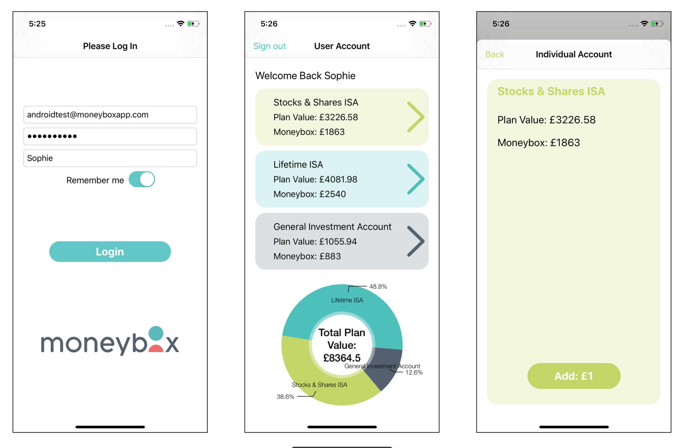

# Moneybox-iOS-Technical-Challenge
In response to Moneybox iOS Technical Challenge (https://github.com/MoneyBox/ios-technical-task)

This 'light' version of the Moneybox and it allowes existing users to login and check their account balance and their moneybox savings

### The app has
- A login screen with remember me functionality
- An overview screen that shows all of the user's accounts, along with a pie chart
- A detail screen that allows the user to add money to their moneybox using the `POST /oneoffpayments` endpoint

Here is a preview of all three screens:

### Enablers
To build this app the following methods were employed:
- Use of Storyboard
- Use of nested URLSession objects so that the token can be passed from one to the next
- Use of Decodable strucs and JSONDecoder to use the data returned from the API POSTs and GETs
- Use of third party library of Charts
- Programmatic segues using delegates to pass data between viewers
- Use of Unit Testing to test the Login POST requests
- Use of this GitHub Repository

### How to use
1. Download this repository
2. Run the Moneybox light (MN).xcworkspace on a Mac that runs XCode
3. Set XCode to run in the iPhone Simulator
4. Press Run
5. Enter the credentials below

|  Username          | Password         |
| ------------- | ------------- |
| androidtest@moneyboxapp.com  | P455word12  |

